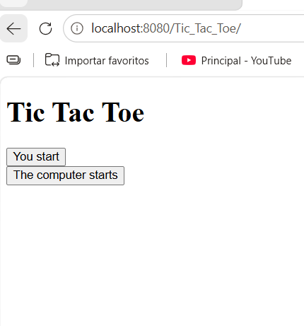
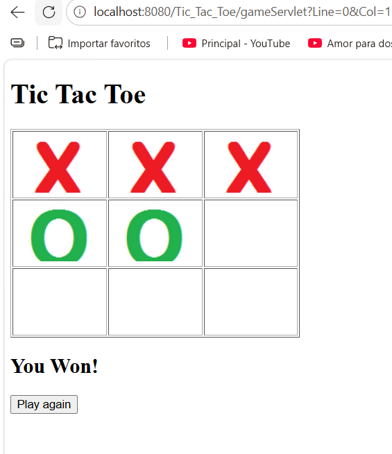

# TicTacToe

Aplicación web dinámica del juego **Tres en Raya (Tic Tac Toe)**, desarrollada en Java utilizando Servlets y JSP, y desplegada sobre el servidor de aplicaciones **WildFly**.

## Descripción

El proyecto permite jugar Tres en Raya contra el computador. El usuario puede elegir quién inicia la partida (el usuario o el computador), y el sistema calcula automáticamente las jugadas de la máquina y determina el ganador (usuario, computador o empate).

## Tecnologías utilizadas

- Java (Servlets)
- JSP (JavaServer Pages) con JSTL
- Servidor de aplicaciones WildFly
- Eclipse IDE

## Estructura del proyecto

- `GameBean.java`: contiene la lógica del juego (estado del tablero, turnos, validación de ganador).
- `GameServlet.java`: procesa cada jugada del usuario y responde con el resultado.
- `EntryServlet.java`: procesa quién inicia la partida.
- `Cell.java` / `Line.java`: representan las celdas y líneas del tablero.
- `index.jsp`: pantalla inicial donde se elige quién empieza.
- `game.jsp`: pantalla del tablero donde se juega la partida.

## Cómo ejecutarlo

1. Importa el proyecto en Eclipse.
2. Configura un servidor WildFly (o Tomcat) en Eclipse.
3. Ejecuta el proyecto en el servidor (Run As → Run on Server).
4. Abre el navegador en la URL del proyecto (por ejemplo `http://localhost:8080/TicTacToe/`).

## Capturas de ejemplo

**Pantalla inicial:**

**Partida en curso:**

